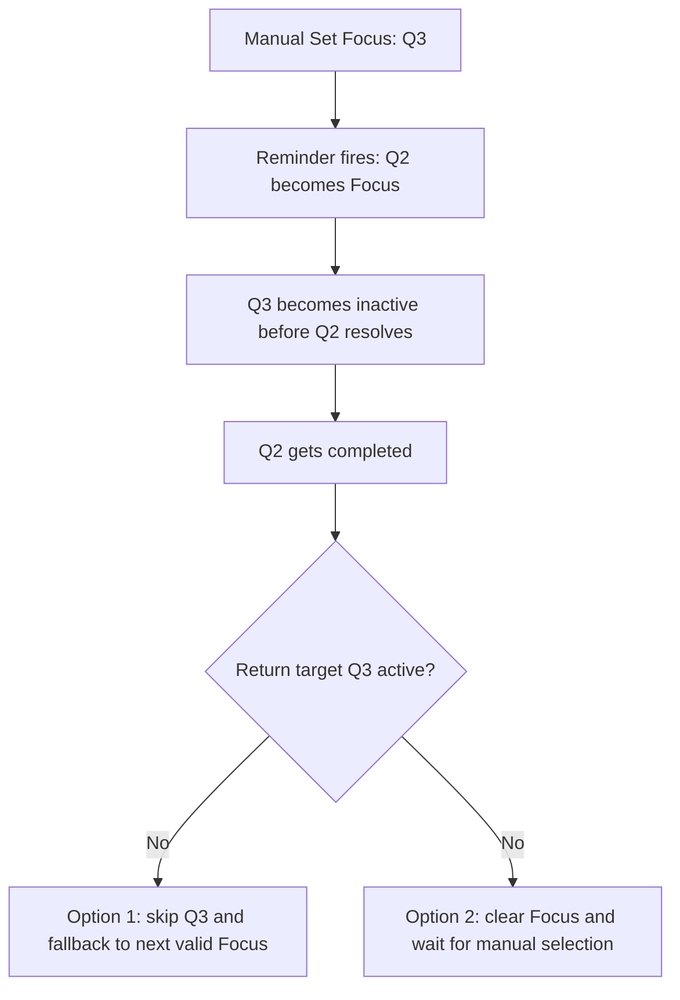

# Fini

**A quest-based productivity system for ADHD brains that helps people finish things.**

**Sign up for the Android beta:**

<a href="https://play.google.com/store/apps/details?id=com.fini.app">
  
</a>

## The Problem

Traditional todo apps fail people with ADHD. They accumulate unfinished tasks, create guilt, and get abandoned within weeks. The more tasks pile up, the harder it becomes to open the app at all.

ADHD brains don't struggle with laziness — they struggle with task paralysis, energy management, and the inability to finish what they started.


## The Idea

Fini replaces the todo list with a quest system inspired by RPG games like Skyrim, Cyberpunk, and The Witcher. Instead of staring at a wall of obligations, you see one active quest at a time.

Quests are organized into **Spaces** — named contexts like Personal, Work, or any project. A Space is a lightweight container; every quest belongs to exactly one space.

### Core Principles (Target — not all implemented yet)

- **One quest at a time.** No overwhelming lists. Just your current mission.
- **Spaces for context.** Group quests by area of life (personal, work, side project) without building a hierarchy.
- **Voice-first input.** Tap the mic, say what's on your mind. AI breaks it into small, achievable steps. _(post-MVP)_
- **Energy-aware.** Tell the app how you feel today. Low energy = lighter quests. High energy = bigger chunks.
- **Abandon is okay.** Quests can be abandoned without guilt. Closing a chapter is a decision, not a failure. Completed and abandoned quests live in History — out of sight, but recoverable.
- **Zero guilt accumulation.** The app never shows you a pile of unfinished tasks. Ever.
- **The app leads, not you.** It tells you what to do next. No planning, no prioritizing, no organizing.
- **Privacy & cyber security.** Your brain is your business. Fini is local-first with no cloud accounts. Encrypted LAN transport is part of sync work; local at-rest encryption is planned.
- **Local-first.** Everything runs on your device. No accounts, no cloud sync required. Optional sync later, on your terms.

### What Makes Fini Different

| Traditional Todo App           | Fini                    |
| ------------------------------ | ----------------------- |
| Shows all tasks at once        | Shows one quest         |
| User organizes and prioritizes | AI handles structure    |
| Unfinished tasks pile up       | Quests can be abandoned |
| Text input                     | Voice-first             |
| Assumes constant energy        | Adapts to energy level  |
| Guilt-driven                   | Guilt-free              |

## Architecture

| Folder | Role |
|---|---|
| `src/` | Vue 3 frontend — see `src/README.md` |
| `src-tauri/` | Rust backend (Tauri 2.0) — see `src-tauri/README.md` |
| `spec/` | Domain model specs shared between frontend and backend |

Each folder has its own `README.md` with structure and conventions. Each significant source file has a companion `.md` spec — see **Spec files** below.

## Spec files

Every significant source file has a companion `.md` file with the same name (e.g. `App.vue` → [[App.md]]). These files are the **source of truth** for that file: they describe its purpose, the sections or structure it must contain, its props/events/commands, and any design decisions. Code should be written to match the spec, not the other way around.

Convention:
- **Domain model specs** live in `spec/` — shared between frontend and backend
- **E2E QA specs** live in `spec/e2e/` — execution guide in `spec/e2e/README.md`
- **UI specs** live next to the source file they describe (e.g. `App.vue` → `App.md`)
- A spec file for a view describes its concept and sections
- A spec file for a component describes its props, events, and behaviour
- A spec file for a store lists its actions
- Folder-level `README.md` files describe the folder's role and overall structure
- Use `[[wikilinks]]` liberally to cross-reference related specs — every mention of another file or concept should link to its spec

## Local Network Sync

Fini is local-first with optional LAN sharing. MVP.1 networking is split into:

- [[DeviceConnection]] for UDP discovery/pairing/presence
- [[SpaceSync]] for websocket-based per-space replication

See [[Network]] for transport-level contracts.

## CLI

`fini` is the single app binary. Its behaviour depends on how it is invoked:

| Invocation | Mode |
|---|---|
| `fini` | Return current Focus quest (CLI default in terminal) |
| `fini app` | Launch GUI (Tauri) from terminal |

The `fini` binary is produced by the normal Tauri build:

```bash
npm run tauri build
# binary at: src-tauri/target/release/fini
```

## Tech Stack

| Layer     | Technology                  |
| --------- | --------------------------- |
| Framework | Tauri 2.0                   |
| Frontend  | Vue 3 + TypeScript + Vite   |
| Styling   | Tailwind CSS + DaisyUI      |
| Icons     | Heroicons                   |
| State     | Pinia                       |
| Database  | SQLite via Diesel ORM       |
| Backend   | Rust                        |

## Target Platforms

- Linux (native + Flatpak)
- Windows
- Android
- macOS (planned)
- iOS (planned)

## Development

### Prerequisites

- Rust (via rustup)
- Node.js + npm
- Linux: webkit2gtk4.1-devel and related packages
- Android: Android Studio, JDK, NDK (see `src-tauri/gen/android/README.md`)

### Run (desktop)

```bash
npm ci
npm run tauri dev -- app
```

### Build (desktop)

```bash
npm run tauri build
```

### Release

Release workflow is triggered only by pushing a signed annotated `v*` tag. The release command first commits the npm, Rust, and Tauri version metadata on `main`, then tags and pushes that exact commit.

```bash
make release VERSION=0.1.12
```

The `make release` flow requires a clean `main` branch that matches `origin/main`, updates `package.json`, `package-lock.json`, `src-tauri/Cargo.toml`, `src-tauri/Cargo.lock`, and `src-tauri/tauri.conf.json`, runs `make build`, creates a `chore: release vX.Y.Z` commit, pushes `main`, then creates and verifies a GPG-signed annotated tag before pushing it.

### Build (Android)

```bash
npm run tauri android build

# git-derived local debug deploy
make android-debug-deploy
```

`make android-debug-deploy` builds a local Android release APK with git-derived version metadata:

- `versionName`: latest reachable git tag plus short SHA, for example `0.1.18+dev.65be60e`
- `versionCode`: current epoch seconds, so repeated local installs always upgrade cleanly

The debug deploy flow signs with the local Android debug keystore and installs with `adb install -r`:

```bash
make android-sign-debug
make android-install-debug
make android-launch
```

Signed debug APK path: `bin/fini.apk`

If you need a purely local install that can replace a Play-installed `com.fini.app` build without uninstalling, use the local release-signing path instead:

```bash
make android-release-deploy-local
```

That flow stays local and requires release-signing inputs in the environment:

- `ANDROID_KEYSTORE_PATH` or `ANDROID_KEYSTORE_BASE64`
- `ANDROID_KEYSTORE_PASSWORD`
- `ANDROID_KEY_ALIAS`
- `ANDROID_KEY_PASSWORD`

Output APK path for the local release-signing flow: `bin/fini-release.apk`

### Build (Flatpak)

```bash
flatpak run org.flatpak.Builder --force-clean --user --install flatpak-build com.fini.app.yml
flatpak run com.fini.app
```

### Build (Docker runtime)

Use the official headless runtime target when you want to run the CLI inside a container:

```bash
make runtime-image

# default CLI behavior
podman run --rm fini-runtime

# explicit CLI commands
podman run --rm fini-runtime --help
podman run --rm -v fini-data:/data fini-runtime app
```

The published container image is CLI-first and uses the release binary. The e2e image is built from a separate `test` target and is not published as the runtime artifact.

## Status

🚧 Early development. Building the MVP.

## Delivery Plan

- **MVP**: Local-first core loop on Linux/Windows/Android with functional parity (`Focus` / `History` / `Settings`, reminders, repeating series+occurrences)
- **MVP.1**: LAN pairing + sync (mutual confirmation, websocket data-plane, near-real-time replication, offline queue/replay, shared series occurrence behavior)
- Planning baseline and spec deltas are tracked in `docs/plans/2026-03-21-mvp-baseline.md`

## Contributing

This is an open-source project. Contributions, ideas, and feedback are welcome.

If you have ADHD and want to help shape this product — you're exactly who we're building this for.

## License

TBD
