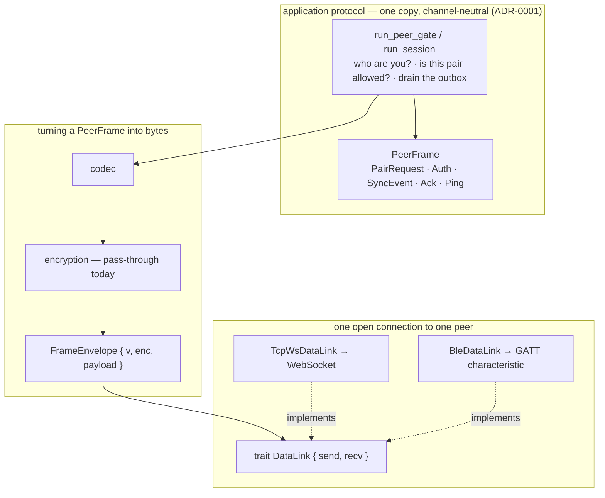
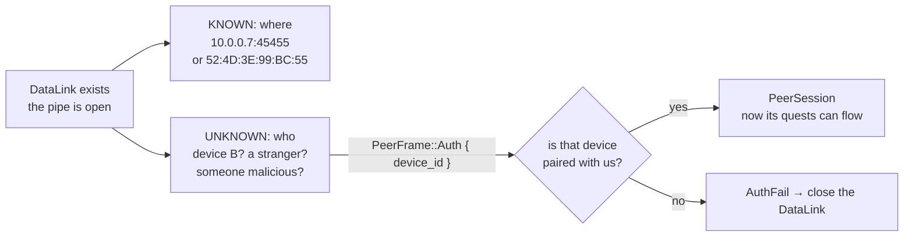
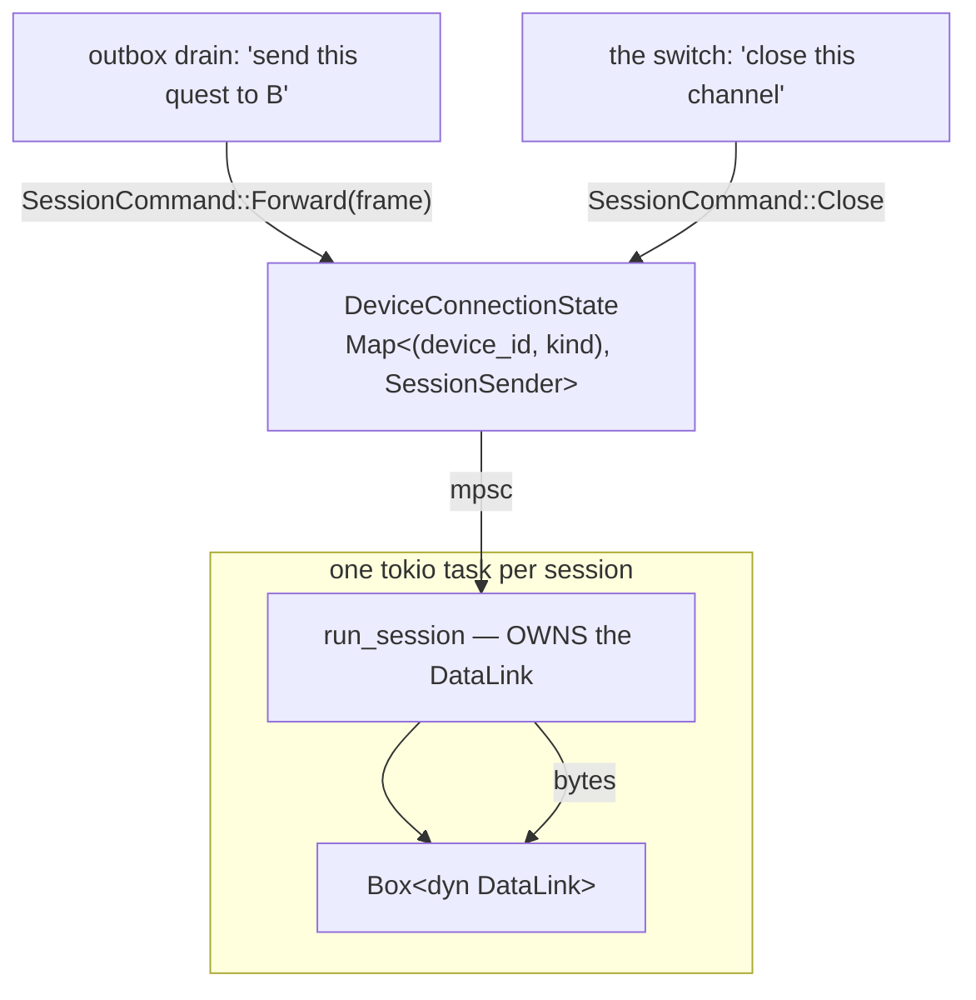
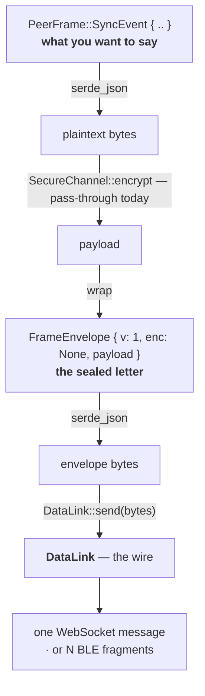

# communication/

Everything two paired devices do to reach each other.

| Module | Owns |
|---|---|
| `pairing` | establishing trust between two devices, and the channels a pair has configured |
| `channel` | carrying bytes — the connection code, the framing, and the encryption seam |
| `sync` | the application protocol that runs over a channel, and the outbox behind it |

What each word means is [`docs/glossary.md`](../../../../docs/glossary.md); how
names are spelled is [`docs/naming.md`](../../../../docs/naming.md). The
one that matters most here: **channel (transport) is one concept.** What a
channel is made of is not a smaller kind of channel.

## The layers



`run_peer_gate` and `run_session` take `&mut dyn DataLink` and cannot tell which
channel is underneath. That is the only job `DataLink` has, and the reason it
exists: before it, the pairing and auth code lived *inside* the WebSocket
accept loop, so a second channel would have meant a second copy of the
handshake — and two copies drift.

## Four words, four different things (see `docs/glossary.md`)

| Name | What it is | How many | Lives from → to |
|---|---|---|---|
| `Channel` | a row: this device + this kind + on/off + primary | one per pair, per kind | set up → unlinked (persisted) |
| `PeerSession` | one live authenticated conversation with one device | one per (device, kind) | auth succeeds → its link drops |
| `DataLink` | the byte pipe under a session | one per connection | socket opens → socket drops |
| `PeerFrame` | one message two devices send each other | one per message | — it's a value |

`Channel` is the only one of these the person ever sees or configures. The
other three are runtime machinery.

### Adding a channel

LoRa is the worked example. It is **a new channel and a new `DataLink`**, which
is the shape every future channel takes:

- a row in `channel_kinds`, so a pair can configure it — no migration, since
  channels are data (ADR-0007)
- a `DataLink` implementation, because LoRa packets are neither a WebSocket nor
  a GATT characteristic
- nothing else: `run_peer_gate` and `run_session` already work over it, and
  the Device page already renders a row per configured channel

What a channel is *made of* is a different question, and does not follow the
same rule. A future WiFi Direct channel would be a new channel with its own
discovery, but would connect over the **same** TCP-WS code the Network
channel uses. That is why connection code can never itself be a channel:
one piece of it can serve several.

## `DataLink` stores nothing in common

`DataLink` is a trait — an interface. It has **no fields**, so there is no shared
state to point at. The two implementations store entirely different things:

```rust
struct TcpWsDataLink {
    sink, source,               // the two halves of the WebSocket
    peer_addr: Option<String>,  // IP-level "who dialled in"
    ping_interval: Interval,    // WebSocket-native keepalive
    missed_pongs: u32,          // declare the pipe dead after N misses
}

struct BleDataLink {
    channel: DatagramChannel,   // ble-gatt's handle
    peer_addr: String,          // the MAC we connected to
}
```

The commonality is the *capability*, not the data — the same way an array
and a generator both satisfy `Iterable` while storing nothing alike.

Note what is absent from both: no `device_id`, no quests, no outbox, no
pairing state. A `DataLink` holds only what it takes to move bytes and to notice
that the pipe died.

`TcpWsDataLink`'s `ping_interval`/`missed_pongs` are **WebSocket-level** pings —
the transport noticing its own death. `PeerFrame::Ping` in the session is a
different check at a different layer: it catches a peer whose pipe is fine
but whose app has stopped answering (ADR-0007).

## A DataLink is not a session: the gap is identity, not connectivity



A `DataLink` is already *established* when it exists — the TCP handshake or the
GATT subscription has completed. What is still unknown is **who** is on the
other end. An IP address is not an identity; anything on the LAN can dial
that port.

The clearest proof the two are different: **a `DataLink` can exist with no
session at all, and routinely does.** A stranger dials in, sends
`PairRequest`, gets an answer, and the link closes. That is the ordinary
pairing path, and it needs a pipe that works *before* anyone is
authenticated.

## A session owns its link exclusively

```rust
pub async fn run_session(
    mut link: Box<dyn DataLink>,                // moved in — the session owns it
    mut rx: mpsc::Receiver<SessionCommand>,
    ...
)
```



What the registry stores is not the `DataLink` but a channel to the task that
owns it:

```rust
pub enum SessionCommand { Forward(PeerFrame), Close }
pub type SessionSender = mpsc::Sender<SessionCommand>;
```

Ownership rather than sharing buys two things:

- **No mutex on every write.** `send` takes `&mut self`, so a shared `DataLink`
  would need a lock around every single frame.
- **No interleaved writes.** On BLE one frame becomes many fragments; two
  writers without a lock would shuffle two messages' fragments together and
  both would arrive as garbage.

The lifetimes line up exactly — a session dies when its link dies — so
ownership makes the wrong thing unrepresentable rather than merely
discouraged.

## Frame, envelope, framing

Three things whose names look related and are not.



- **`PeerFrame`** — an application message. One quest edit. A value.
- **`FrameEnvelope`** — `{ v, enc, payload }`, the versioned wrapper around
  an encoded frame. It exists so switching real encryption on later is
  additive: every frame ever sent already carries `v: 1` and `enc: none`, so
  an older device can say "I don't know that scheme" instead of choking on
  what looks like garbage.
- **"framing"** (`codec::length_delimited`, BLE fragments) — where one blob
  *ends* on a raw byte pipe. Unrelated to `PeerFrame` despite the spelling.

The distance between the last two is not academic: one ~400-byte `SyncEvent`
— a single `PeerFrame` — once landed on BLE as **238 fragments** taking 20+
seconds, which is what drove the base64 payload encoding in `envelope.rs`.
One frame, 238 framings.
